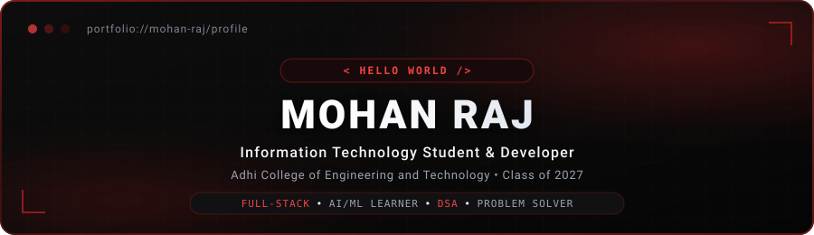

<!-- ================================================================= -->
<!--                MOHAN RAJ — GITHUB PROFILE README                  -->
<!-- ================================================================= -->

<a name="top" id="top"></a>

<div align="center">

  <!-- 1. HEADER / BANNER -->
  

  <br/><br/>

  <!-- 2. TYPING INTRODUCTION -->
  <a href="https://github.com/MohanRaj2112">
    
  </a>

  <br/>

  <!-- 3. SOCIAL BUTTONS -->
  <p align="center">
    <a href="https://github.com/MohanRaj2112" target="_blank">
      
    </a>
    <!-- PLACEHOLDER: Replace with your actual LinkedIn profile URL -->
    <a href="https://www.linkedin.com/in/" target="_blank">
      
    </a>
    <!-- PLACEHOLDER: Replace with your actual Email address -->
    <a href="mailto:your-email@example.com">
      
    </a>
    <!-- PLACEHOLDER: Replace with your actual LeetCode profile URL -->
    <a href="https://leetcode.com/" target="_blank">
      
    </a>
  </p>

  <!-- 4. PROFILE VIEWS -->
  <p align="center">
    
  </p>

  

</div>

<br/>

<!-- ================================================================= -->
<!-- 5. ABOUT ME                                                       -->
<!-- ================================================================= -->

## 📌 About Me

```yaml
name: Mohan Raj
role: Information Technology Student & Developer
institution: Adhi College of Engineering and Technology
batch: 2023 - 2027
current_cgpa: 8.0
location: India
status: College Student • Internship Seeker • Fresher • Placement Preparation
passions: [Full-Stack Web Development, AI/ML Learning, Problem Solving, Data Structures & Algorithms]
```

I am an **Information Technology student** and beginner developer passionate about software engineering, full-stack web development, Artificial Intelligence, Machine Learning, and systematic problem solving.

Currently, I am strengthening my programming foundations in **Java, C, and Python**, practicing **Data Structures & Algorithms**, and building practical full-stack web applications. I am actively preparing for software developer roles, internships, and campus placements by turning concepts into functioning code.

* 📍 **Location:** India
* 🎓 **Degree:** B.Tech in Information Technology (2023 – 2027)
* 💡 **Current Focus:** Strengthening core DSA logic and developing full-stack applications with React, Node.js, and MongoDB
* 🤝 **Open For:** Internship opportunities, student collaborations, and fresher developer roles

<br/>

<div align="center">
  
</div>

<br/>

<!-- ================================================================= -->
<!-- 6. EDUCATION                                                      -->
<!-- ================================================================= -->

## 🎓 Education

| Degree / Certificate | Institution | Period / Score |
| :--- | :--- | :--- |
| **B.Tech – Information Technology** | **Adhi College of Engineering and Technology** | **2023 – 2027** <br/> Current CGPA: `8.0` |
| **Higher Secondary Certificate (HSC)** | **Government Boys School – Kozhappalur** | **Score: `75%`** |
| **Secondary School Leaving Certificate (SSLC)** | **Government High School – Avaniyapuram** | *Completed* |

<br/>

<div align="center">
  
</div>

<br/>

<!-- ================================================================= -->
<!-- 7. INTERNSHIP                                                     -->
<!-- ================================================================= -->

## 💼 Internship Experience

### 🏢 **Inertz Technology**
* **Role:** AI & ML Intern
* **Duration:** 10 Days
* **Domain:** Artificial Intelligence & Machine Learning

#### Key Learnings & Practical Exposure:
* 🐍 **Python Programming:** Practical coding and scripting fundamentals for data tasks.
* 🤖 **AI Fundamentals:** Overview of Artificial Intelligence architecture and modern capabilities.
* 🧠 **Machine Learning Concepts:** Understanding foundational supervised and unsupervised learning approaches.
* 📊 **Data Handling:** Techniques for reading, preprocessing, and organizing datasets.
* 📈 **Basic Data Analysis:** Hands-on dataset exploration and summary insights.
* 🛠️ **Practical AI/ML Exposure:** Beginner-friendly workflows bridging theoretical concepts with code.

<br/>

<div align="center">
  
</div>

<br/>

<!-- ================================================================= -->
<!-- 8. FEATURED PROJECT                                               -->
<!-- ================================================================= -->

## 🌟 Featured Project

### 🏗️ **MasonMate – Construction Service Management System**

> A comprehensive construction service management system built to streamline construction services, mason hiring, and tool/equipment rental logistics.

```
React (Frontend) ───► Express / Node.js (REST API) ───► MongoDB (Database)
```

* **Mason Booking Engine:** Enables customers to discover, evaluate, and book masons for construction jobs.
* **Service Management:** Centralized dashboard for managing construction service workflows.
* **Equipment & Tool Rental:** Dedicated catalog for browsing and renting essential construction tools and equipment.
* **Product & Tool Listings:** Structured item listings with detailed specifications and availability.
* **Role Interactions:** Seamless user interactions alongside comprehensive admin oversight.

**Tech Stack:** `React` • `Node.js` • `Express.js` • `MongoDB`

```markdown
[View Repository](https://github.com/MohanRaj2112) • [Documentation Available in Repo]
```

<br/>

<div align="center">
  
</div>

<br/>

<!-- ================================================================= -->
<!-- 9. OTHER PROJECTS                                                 -->
<!-- ================================================================= -->

## 🚀 Projects Showcase

### 📱 **IT Attendance Management App**
* **Concept:** Multi-role attendance management application designed for academic environments.
* **Key Roles:** Distinct access and views for **Admin**, **Faculty**, and **Students**.
* **Current Enhancements:**
  * Responsive layouts optimized for both mobile smartphones and laptops.
  * Adaptive UI adjustments tailored to screen sizes.
  * Cleaner section organization and a simplified login workflow.

---

### 🎂 **Full-Stack Birthday Celebration Website**
* **Concept:** An interactive, memory-rich full-stack celebration web application.
* **Features:**
  * 📸 Memories & photo gallery showcase
  * 💌 Heartfelt interactive messages
  * ⏳ Live real-time countdown timer
  * 🎵 Integrated background music player
  * 🔌 Custom Node.js & Express RESTful API backend
  * 🍃 MongoDB database integration for persisting wishes and memories
* **Tech Stack:** `React` • `Node.js` • `Express.js` • `MongoDB`

---

### 📊 **AIML & Data Analysis Projects**
* **Concept:** Practical exploratory data analysis and visualization pipelines.
* **Key Work:**
  * Dataset cleaning, missing value handling, and data normalization.
  * Exploratory data analysis (EDA) uncovering key distribution patterns.
  * Statistical chart generation and data storytelling.
* **Tech Stack:** `Python` • `Pandas` • `Matplotlib` • `Seaborn`

<br/>

<div align="center">
  
</div>

<br/>

<!-- ================================================================= -->
<!-- 10. DSA / LEETCODE JOURNEY                                        -->
<!-- ================================================================= -->

## 🧩 Problem Solving & DSA Journey

I practice **Data Structures and Algorithms** regularly to build strong analytical skills and write efficient, optimized code.

```
       [ Core Topics Under Practice ]
       ├── Arrays & Strings
       ├── HashMap & HashSet
       ├── Stacks & Queues
       ├── Linked Lists
       ├── Recursion & Backtracking
       └── Sorting & Searching
```

* **Primary Language for DSA:** Java
* **Platform:** [LeetCode](https://leetcode.com/) *(regular practice)*
* **Focus:** Problem decomposition, time/space complexity optimization, and clean implementation.

<!-- Replace the URL below with your genuine LeetCode profile URL -->
<p align="left">
  <a href="https://leetcode.com/" target="_blank">
    
  </a>
</p>

<br/>

<div align="center">
  
</div>

<br/>

<!-- ================================================================= -->
<!-- 11. TECH STACK                                                    -->
<!-- ================================================================= -->

## 🛠️ Tech Stack & Skills

### 💻 Programming Languages
<p align="left">
  
</p>

### 🌐 Web Development
* **Frontend:** HTML5, CSS3, React *(actively learning & building projects)*
* **Backend:** Node.js, Express.js
<p align="left">
  
</p>

### 🗄️ Databases
<p align="left">
  
</p>

### 📊 Data Analysis & AI/ML
<p align="left">
  
  
  
  
</p>

### 🔧 Tools & Version Control
<p align="left">
  
</p>

<br/>

<div align="center">
  
</div>

<br/>

<!-- ================================================================= -->
<!-- 12. CURRENTLY LEARNING                                            -->
<!-- ================================================================= -->

## 📖 Currently Learning

* 🧩 **Data Structures & Algorithms:** Advancing understanding of non-linear structures and algorithmic patterns.
* ☕ **Java Fundamentals & OOP:** Solidifying Object-Oriented Programming principles.
* ⚛️ **React & Frontend Engineering:** Component architecture, hooks, and responsive state management.
* 🚀 **Backend Development:** Scalable REST APIs using Express.js and Node.js.
* 🤖 **Artificial Intelligence & Machine Learning:** Core concepts, dataset preparation, and evaluation.
* 🎯 **Systematic Problem Solving:** Translating real-world specifications into testable software.

<br/>

<div align="center">
  
</div>

<br/>

<!-- ================================================================= -->
<!-- 13. GITHUB ANALYTICS                                              -->
<!-- ================================================================= -->

## 📈 GitHub Analytics

<div align="center">

  <!-- Overall GitHub Stats -->
  <a href="https://github.com/MohanRaj2112">
    
  </a>
  <br/><br/>

  <!-- Top Languages & Streak Stats -->
  <a href="https://github.com/MohanRaj2112">
    
  </a>
  &nbsp;
  <a href="https://github.com/MohanRaj2112">
    
  </a>

</div>

<br/>

<div align="center">
  
</div>

<br/>

<!-- ================================================================= -->
<!-- 14. CONTRIBUTION ACTIVITY                                         -->
<!-- ================================================================= -->

## 🐍 Contribution Activity

<p align="center">
  
</p>

<p align="center">
  <i>My GitHub contribution activity</i>
</p>

<br/>

<div align="center">
  
</div>

<br/>

<!-- ================================================================= -->
<!-- 15. CAREER GOAL                                                   -->
<!-- ================================================================= -->

## 🎯 Career Goal

> I am working toward becoming a strong software developer by improving my programming fundamentals, Data Structures & Algorithms, full-stack development skills, and practical problem-solving ability.

<br/>

<div align="center">
  
</div>

<br/>

<!-- ================================================================= -->
<!-- 16. LET'S CONNECT                                                 -->
<!-- ================================================================= -->

## 🤝 Let's Connect

I am always open to discussing new projects, learning opportunities, tech discussions, and developer collaborations.

<div align="center">

  <a href="https://github.com/MohanRaj2112" target="_blank">
    
  </a>
  &nbsp;
  <!-- Replace with your actual LinkedIn profile link -->
  <a href="https://www.linkedin.com/in/" target="_blank">
    
  </a>
  &nbsp;
  <!-- Replace with your actual Email address -->
  <a href="mailto:your-email@example.com">
    
  </a>
  &nbsp;
  <!-- Replace with your actual LeetCode profile link -->
  <a href="https://leetcode.com/" target="_blank">
    
  </a>

</div>

<br/>

<!-- ================================================================= -->
<!-- 17. FOOTER                                                        -->
<!-- ================================================================= -->

<div align="center">

  

  <br/><br/>

  <p align="center">
    Designed with ❤️ &bull; <b>Mohan Raj</b> &bull; &copy; 2026
  </p>

  <p align="center">
    <a href="#top">
      
    </a>
  </p>

</div>

